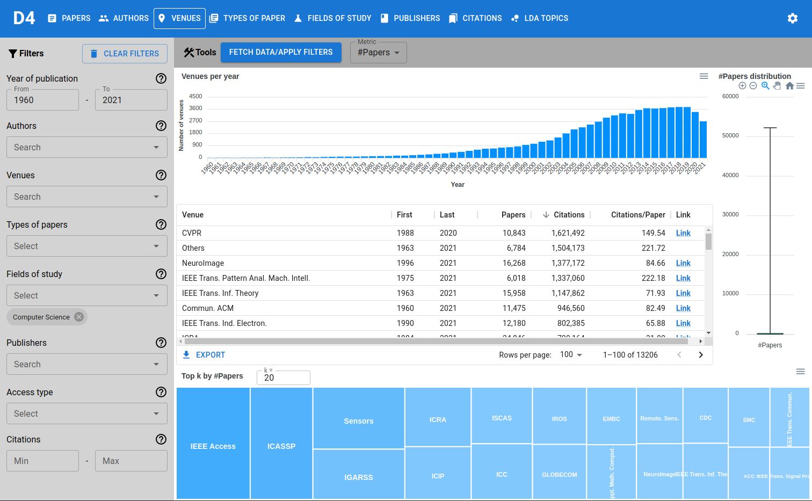

# cs-insights-frontend

<p align="center">
<a href="https://github.com/gipplab/cs-insights-frontend/actions/workflows/release.yml"></a>  
<a href="https://github.com/gipplab/cs-insights-frontend/actions/workflows/main.yml"></a>
<a href="https://github.com/gipplab/cs-insights-frontend/releases"></a>
<a href="https://hub.docker.com/repository/docker/jpelhaw/nlp-land-frontend"></a>
<a href="https://github.com/gipplab/cs-insights-frontend/blob/master/LICENSE"></a>
<a href="https://github.com/airbnb/javascript"></a>
<a href="https://gipplab.github.io/cs-insights-uptime/"></a>
<a href="https://gipplab.github.io/cs-insights-uptime/"></a>
<br/>
<br/>
<a href="http://cs-insights.uni-goettingen.de/">
    
</a>
<br/>
<br/>
<a href="http://cs-insights.uni-goettingen.de/">View Demo</a>
<br/>
<br/>
Demo Credentials <br/>
user: demo@cs-insights.com <br/>
password: demo
</p>

> Starting from version 1.0.0, this project is using [semantic versioning](https://semver.org/). For more infos about the features supported, see the [releases](https://github.com/gipplab/cs-insights-frontend/releases).

## Getting Started

This project is part of the `cs-insights`-ecosystem. Please refer to the readme [here](https://github.com/gipplab/cs-insights-main) to spin up the development and production system.


## Repository
### Structure
In the `src` folder we have the following structure:
- /components: All UI components
  - /charts: UI components that visualize data
- /context: All context used for global state
- /routes: All routes of this app
  - /dashboards: Routes that visualize data
- Other files

### Packages
The following is a list of some notable packages we use:
- [ApexCharts](https://apexcharts.com/react-chart-demos/): Charts
- [Material UI (MUI)](https://mui.com/): UI components (except charts)
  - [Emotion](https://emotion.sh/docs/introduction): Styling in MUI
- [React Query](https://react-query.tanstack.com/): Data synchronization for network calls
- [React Router](https://reactrouter.com/): Routing


## Branches, tags, and deploys.
Whenever a new issue is opened, it should be labeled whether it is a Patch, Minor, or Major upgrade. Please see the label descriptions for more info.
To work on that issue, a branch should be created with the leading issue number like "1-user-view".
We recommend using [GitHub's built-in system](https://docs.github.com/en/issues/tracking-your-work-with-issues/creating-a-branch-for-an-issue) for this.

When finalizing a branch, use:
```sh
npm version <label: {patch, minor, or major}>
```
and push your code. Then create a pull request, include "Fixes #{issue_number}" in the title and resolve any merge conflicts. When all tests are done, another contributor can review and merge the request.
After the merge is complete, please delete the branch on the bottom of the pull request.


## License
This project is licensed under the terms of MIT license. For more information, please see the [LICENSE](LICENSE) file.

## Citation
If you use this repository, or use our tool for analysis, please cite our work:
```
@inproceedings{Wahle2022c,
  title        = {D3: A Massive Dataset of Scholarly Metadata for Analyzing the State of Computer Science Research},
  author       = {Wahle, Jan Philip and Ruas, Terry and Mohammad, Saif M. and Gipp, Bela},
  year         = {2022},
  month        = {July},
  booktitle    = {Proceedings of The 13th Language Resources and Evaluation Conference},
  publisher    = {European Language Resources Association},
  address      = {Marseille, France},
  doi          = {},
}
```
